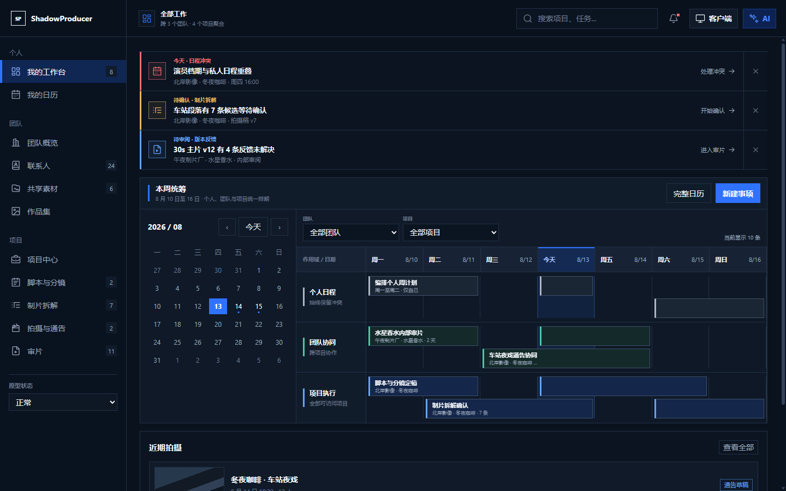

<p align="center">
  
</p>

<h1 align="center">ShadowProducer</h1>

<p align="center">把团队、剧本、制片拆解、拍摄执行、审片与素材交付放进同一条可追溯的生产链。</p>

<p align="center">
  
  
  
  
</p>

<p align="center">
  <a href="#当前交付状态"><strong>当前能力</strong></a>
  &nbsp;·&nbsp;
  <a href="#核心工作流">核心工作流</a>
  &nbsp;·&nbsp;
  <a href="#本地运行">本地运行</a>
  &nbsp;·&nbsp;
  <a href="./PRODUCT_REQUIREMENTS.md">产品需求</a>
</p>

<p align="center">
  
</p>

---

## 这是什么

ShadowProducer 是面向影视与内容团队的云端制片协作平台。它以团队和项目为权限边界，把剧本版本、分镜、制片拆解、排期、通告单、审片、素材、联系人和作品集连接成一条可回读、可审计的生产链。

平台同时为人和 Agent 提供受权限约束的操作入口。重要写操作带 revision、幂等键和审计记录；Agent 不能绕过人工确认，也不能把建议直接伪装成正式生产事实。

<table>
  <tr>
    <td width="33%" valign="top"><b>团队与项目</b><br><sub>在多团队、多项目之间切换，按 owner、editor、viewer 等角色控制读取与写入。</sub></td>
    <td width="33%" valign="top"><b>剧本与分镜</b><br><sub>管理不可变剧本版本、来源行范围、影响分析、分镜文档和评审批注。</sub></td>
    <td width="33%" valign="top"><b>制片执行</b><br><sub>从专业拆解进入拍摄阶段、资源冲突、通告单发布与变更历史。</sub></td>
  </tr>
  <tr>
    <td valign="top"><b>审片闭环</b><br><sub>上传审片版本，生成受限外部链接，收集帧级意见并保留版本与身份边界。</sub></td>
    <td valign="top"><b>素材与作品集</b><br><sub>使用对象存储管理素材、上传和派生结果，再将已批准内容组织到公开作品集中。</sub></td>
    <td valign="top"><b>受控 Agent</b><br><sub>Agent 通过稳定命令契约提出或执行获准动作，结果、回执和失败都可追踪。</sub></td>
  </tr>
</table>

## 核心工作流

1. **建立工作空间**：创建团队与项目，邀请成员并分配角色。
2. **冻结创作输入**：上传剧本，形成不可变版本，再进行分镜和影响分析。
3. **进入制片拆解**：整理角色、场景、道具、时间和资源，确认候选修改。
4. **安排拍摄执行**：生成拍摄阶段与通告单，检查人员、地点和设备冲突。
5. **审片与交付**：上传版本、收集批注、完成批准，并把结果沉淀到素材库与作品集。

## 当前交付状态

仓库中的 P1 主流程已经完成并经过 Web、API、PostgreSQL、构建和浏览器读回验证。当前实现包括团队协作、剧本与分镜、制片拆解、排程与通告、审片、素材、联系人、作品集、数据导出和受控 Agent 命令等能力。

以下边界仍需明确：

- `infra/docker-compose.yml` 只启动 PostgreSQL / pgvector 与 MinIO，不会启动 Web、API 或 Worker。
- 转录、多模态和向量能力依赖远程 OpenAI-compatible 服务；没有本地模型或关键词降级。
- 真实供应商质量、生产 DNS / TLS / 反向代理和生产容量仍需在目标环境单独验收。
- `0.1.0` 是当前私有工作区版本，不代表已经存在公开 Release。

## 技术结构

| 层 | 技术与职责 |
| --- | --- |
| Web | Next.js 16、React 19、TypeScript 7、Tailwind CSS 4、shadcn / Radix |
| API | Fastify 5、Kysely、Better Auth、AWS S3 client |
| 数据 | PostgreSQL 17 + pgvector，MinIO 对象存储 |
| 后台任务 | 媒体 Worker 与分析 Worker；FFmpeg / FFprobe 处理媒体 |
| 工作区 | pnpm 11、Turborepo、Biome、Vitest、Playwright |

架构决策与边界见 [`TECHNICAL_ARCHITECTURE.md`](./TECHNICAL_ARCHITECTURE.md)。

## 本地运行

准备 Node.js 24+、pnpm 11、Docker，以及可从 `PATH` 调用的 FFmpeg / FFprobe。

```powershell
pnpm install
docker compose -f infra\docker-compose.yml up -d
pnpm db:migrate
```

启动 API：

```powershell
pnpm dev:api
```

在另一个终端启动 Web：

```powershell
$env:PORT = "3211"
pnpm dev
```

访问 `http://127.0.0.1:3211`。`pnpm db:migrate` 会幂等应用迁移并生成本地开发数据；远程模型、生产密钥和公开地址按 [`.env.example`](./.env.example) 配置到对应进程环境。

需要处理媒体或 AI 分析任务时，再分别启动 Worker：

```powershell
pnpm --filter @shadowproducer/api media:worker
pnpm --filter @shadowproducer/api analysis:worker
```

## 验证

```powershell
pnpm lint
pnpm typecheck
pnpm test
pnpm --filter @shadowproducer/api test:postgres
pnpm build
```

PostgreSQL 测试要求 `infra/docker-compose.yml` 中的数据库已经运行。完整实现证据、浏览器读回和外部边界见 [`verification.md`](./verification.md)。

## 文档

- [产品需求](./PRODUCT_REQUIREMENTS.md)
- [技术架构](./TECHNICAL_ARCHITECTURE.md)
- [验证记录](./verification.md)

## 许可

当前仓库尚未声明项目级开源许可证。第三方依赖、模型服务、字体与素材继续服从各自条款。
